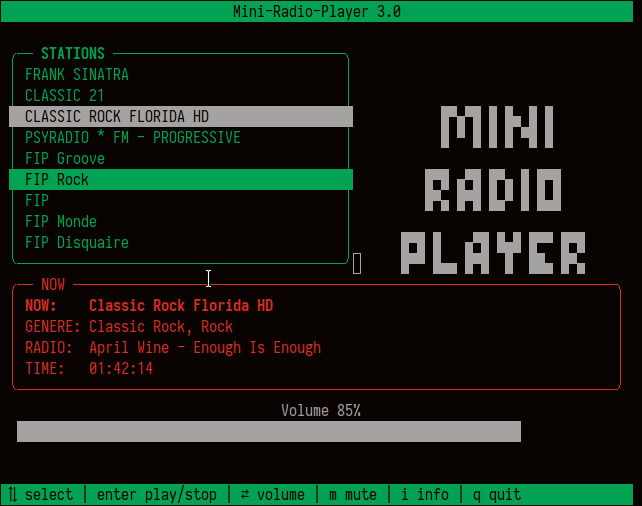

# mini-radio-player-pycui
Mini Radio Player with py-cui and python-vlc

https://pypi.org/project/python-vlc/

https://github.com/jwlodek/py_cui





# Install

Using python3 virtualenv

- debian : python3-venv

```bash
git clone https://github.com/wdog/mini-radio-player-pycui/
cd mini-radio-player-pycui
python3 -m venv venv
source venv/bin/activate
pip3 install -r requirements.txt

./r.py
```
